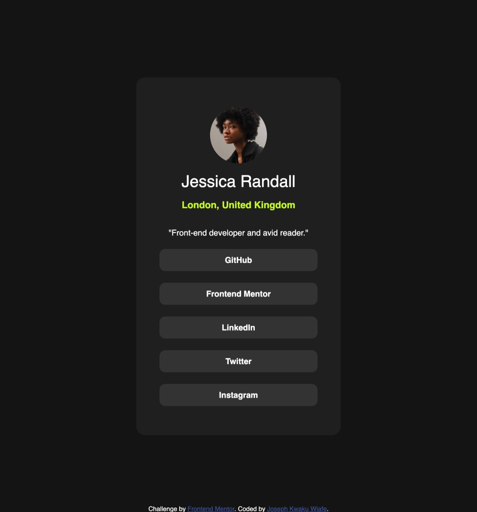

# Frontend Mentor - Social links profile solution

This is a solution to the [Social links profile challenge on Frontend Mentor](https://www.frontendmentor.io/challenges/social-links-profile-UG32l9m6dQ). Frontend Mentor challenges help you improve your coding skills by building realistic projects. 

## Table of contents

- [Overview](#overview)
  - [The challenge](#the-challenge)
  - [Screenshot](#screenshot)
  - [Links](#links)
- [My process](#my-process)
  - [Built with](#built-with)
  - [What I learned](#what-i-learned)
  - [Continued development](#continued-development)
  - [Useful resources](#useful-resources)
- [Author](#author)

**Note: Delete this note and update the table of contents based on what sections you keep.**

## Overview

### The challenge

Users should be able to:

- See hover and focus states for all interactive elements on the page

### Screenshot

### Links

- Solution URL: [Add solution URL here](https://your-solution-url.com)
- Live Site URL: [Add live site URL here](https://your-live-site-url.com)

## My process

### Built with

- Semantic HTML5 markup
- CSS custom properties
- Flexbox
- CSS Grid
- [Styled Components](https://styled-components.com/) - For styles

### What I learned

I learnt more how responsive I can make the file with just css

### Continued development

I still have some challenges with the flexbox, flex, block... that kinda thing... still working on it though.

### Useful resources

- Deepseek [https://deepseek.ai]

## Author

- Website - [Joseph Kwaku Wiafe](https://www.your-site.com)
- Frontend Mentor - [@jkwaife](https://www.frontendmentor.io/profile/jkwiafe)
- Instagram - [@jkwiafe](https://www.instagram.com/jk.wiafe)
